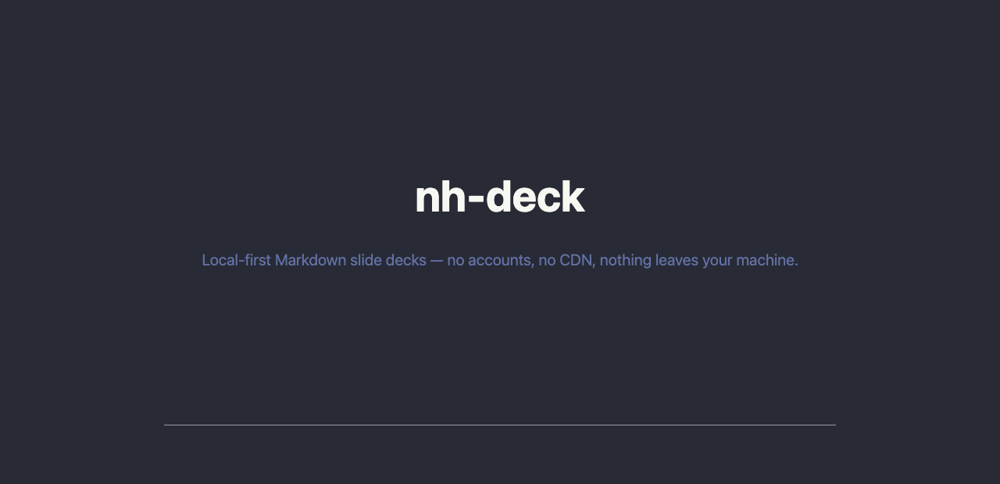
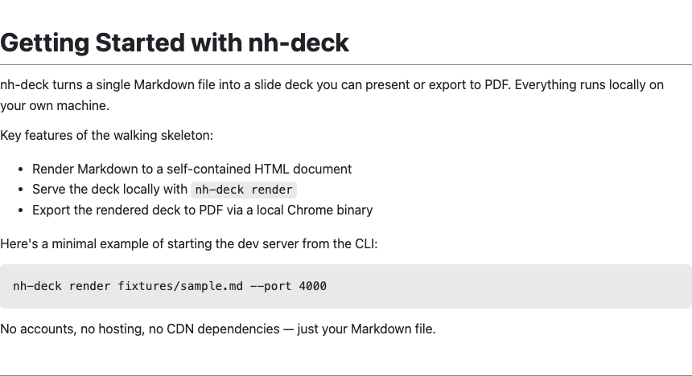
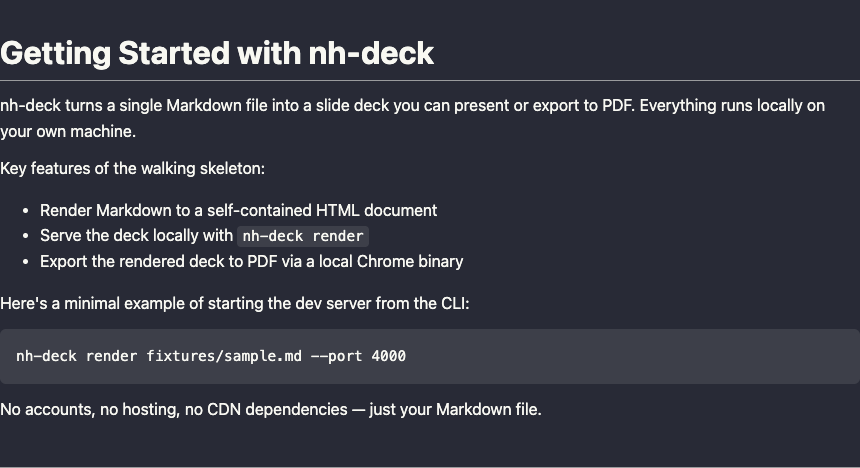
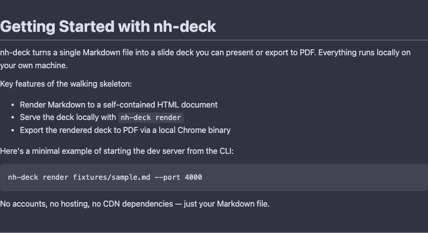
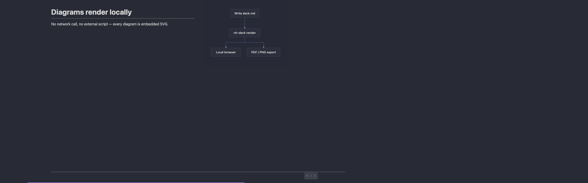
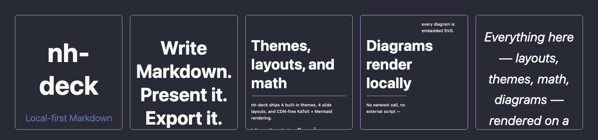

# nh-deck

nh-deck is a local-first CLI tool for writing, presenting, and exporting Markdown-based slide decks. Write your deck as plain Markdown, render it and serve it from a local HTTP server on your own machine, present it straight from your browser, and export it to PDF — all without an internet connection or an account, and without any of it ever leaving your machine. It's one of three independent sibling projects under the [Not-Humans-Lab](../Not-Humans-Lab/) umbrella (alongside `nh-skills` and the planned `daily-dose`), each an independent repo with its own toolchain.



## Installation

```bash
npx nh-deck <command>
# or
npm install -g nh-deck
```

To build and run from source instead:

```bash
git clone https://github.com/sairam0424/nh-deck.git
cd nh-deck
npm install
npm run build
node dist/index.js <command>
```

## Usage

Render a Markdown deck and serve it locally, then open it in your browser (add `--no-open` to skip auto-opening, `--port <n>` to pin a specific port, `--watch` to re-render and auto-refresh the browser whenever the file changes, or `--css <path>` to fully replace the default stylesheet with your own):

```bash
nh-deck render deck.md
```

Export a deck to PDF:

```bash
nh-deck pdf deck.md
```

Export a deck to one PNG per slide:

```bash
nh-deck png deck.md
```

`pdf` and `png` also accept `--css <path>` to replace the default stylesheet, same as `render`.

(from a local clone, substitute `node dist/index.js` for `nh-deck` in any of the examples above)

PDF export works by launching a Chrome/Chromium/Edge/Brave binary that's already installed on your machine (via `puppeteer-core` + `chrome-launcher`) — nh-deck never downloads or bundles a browser itself.

Add presenter notes to any slide with a standalone HTML comment — they're hidden by default and shown by adding `?notes` to the served URL:

```markdown
# Slide title

<!-- remember to slow down here -->

Slide content...
```

## Themes

nh-deck ships 4 fixed, named color themes — `light`, `dark`, `dracula`, and `nord` — that recolor the base deck (background, text, borders, code blocks), KaTeX math, and Mermaid diagrams consistently. A deck with no theme requested renders exactly as it always has. Explicitly requesting the `light` theme is close, but not identical, to that default — code-block backgrounds in particular differ noticeably (see `docs/adr/0008-named-theme-system.md`).

Run `nh-deck list-themes` to print the fixed set of theme names from the command line (noting which one is the default), without rendering anything.

| `light` (default) | `dark` |
| --- | --- |
|  |  |

| `dracula` | `nord` |
| --- | --- |
|  |  |

Select a theme either via a `--theme <name>` flag on any of `render`, `pdf`, or `png`:

```bash
nh-deck render deck.md --theme dark
```

or via a `theme:` key in the deck's own Markdown frontmatter, so the choice travels with the file:

```markdown
---
theme: dracula
---
# My deck

Slide content...
```

If both are given, `--theme` wins over the frontmatter value. An unrecognized theme name prints a non-fatal warning to stderr and falls back to `light` — it never blocks rendering or export.

`--css <path>` always wins over any requested theme (flag or frontmatter) — the two are mutually exclusive, with no CSS-cascade layering. If you pass both, nh-deck prints a stderr note and uses your custom stylesheet, not the theme's colors. See `docs/adr/0008-named-theme-system.md` for the full design rationale.

## Layouts

4 fixed, opt-in per-slide layouts — `title`, `section`, `two-column`, and `quote` — for slides that need a different structure than the default. Select one per slide with a standalone HTML comment:

```markdown
<!-- layout: title -->

# My Presentation

A subtitle for the opening slide.
```

A slide with no marker renders exactly as it always has. Layouts apply everywhere — `render`, `pdf`, and `png` — since they change slide structure, not just the live-presenting view. An unrecognized layout name is silently ignored (no class applied, no warning).

## Presentation mode & transitions

Add `?present` to the URL `render` serves to switch from the default continuous-scroll view to one-slide-at-a-time presentation mode, with a slide counter and progress bar in the corner:



- Advance with the right arrow key, `Space`, a click, or a left swipe on a touchscreen (links inside slide content still work normally); go back with the left arrow key or a right swipe.
- `Home`/`End` jump straight to the first/last slide.
- `Escape` exits presentation mode back to the continuous-scroll view, without a full page reload.
- `o` (or `Escape` while it's open) toggles a grid overview of every slide — click any thumbnail to jump straight to it:



Your position survives a `--watch` reload via the URL's hash.

Animate the transition between slides with `--transition <name>` (`fade` or `slide`), or a `transition:` key in frontmatter:

```bash
nh-deck render deck.md --transition fade
```

Transitions only apply inside presentation mode on `render` — `pdf` and `png` never read the flag, since a static export has no discrete slide changes to animate between. `--css` wins over both layout and transition CSS, same as it wins over themes. Slide transitions also respect `prefers-reduced-motion`, substituting a fast crossfade instead of the full animation. See `docs/adr/0009-templates-transitions-presentation-mode.md` for the full design rationale.

## Current limitations

- **The 4 themes, 4 layouts, and 2 transitions are fixed sets, not user-extensible** — `--css` is the only escape hatch beyond them (a full stylesheet replacement, not a per-color or per-layout override).
- **Cross-browser PDF-export visual fidelity is checked in CI, not guaranteed on every machine** — a dedicated CI job compares pixel output between two distinct Chrome-family browsers on every PR (see `docs/adr/0007-pdf-cross-browser-fidelity-check.md`), but which specific browser `chrome-launcher` finds on your own machine (Chrome vs. Edge vs. Brave) can still vary.
- **PPTX export is out of scope** — PDF and per-slide PNG are the only export formats.

KaTeX (math rendering) and Mermaid (diagrams) are both supported today, CDN-free — see `AGENTS.md`'s Known Gotchas for how.

nh-deck never phones home and the rendered HTML never depends on a CDN for correctness — that local-first constraint is absolute.
