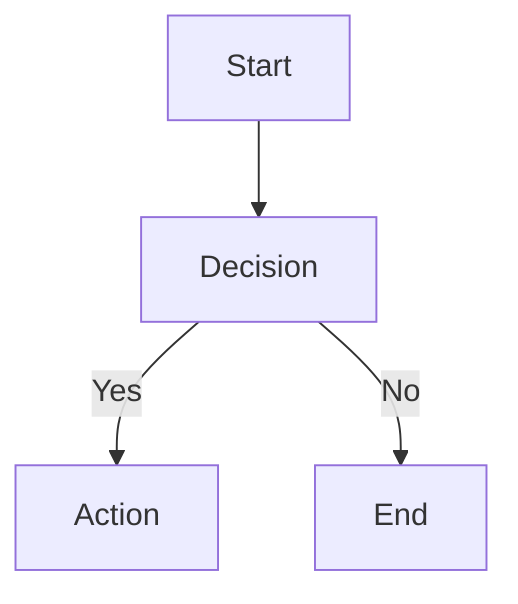

# Phase 4b — Mermaid Diagrams (Local-Only) — Implementation Plan

> **For agentic workers:** REQUIRED SUB-SKILL: Use superpowers:subagent-driven-development (recommended) or superpowers:executing-plans to implement this plan task-by-task. Steps use checkbox (`- [ ]`) syntax for tracking.

**Goal:** Add Mermaid diagram rendering via fenced ` ```mermaid ` code blocks, with zero CDN dependency anywhere. This is the second half of the highest-risk roadmap item (`docs/specs/feature-implementation-roadmap-design.md` §6) — the obvious library choice for Mermaid-without-a-browser (`beautiful-mermaid`) turned out to have its own real CDN anti-pattern baked into its output, found only by re-verifying rendered output content, not just the npm dependency tree.

**Explicit scope authorization:** nh-deck's `CLAUDE.md` requires stopping and asking before any diff that could introduce a runtime network dependency, specifically naming Mermaid as an example. The user's standing authorization for Phase 4 (KaTeX + Mermaid, both local-only) covers this sub-phase — see the spec's §0. This plan's design additionally removes a CDN dependency that would otherwise have been silently introduced by the chosen library's own default output, which is squarely inside what that gate exists to catch.

**Architecture:** `beautiful-mermaid`'s `renderMermaidSVG(text, options?)` is a synchronous, DOM-free, Puppeteer-free function that returns a self-contained SVG string per diagram (its own inline `<style>` block, no external asset references except the CDN font `@import` this plan strips). A new `src/mermaidRenderer.ts` module wraps that call: it strips the `@import url(...)` line(s) from the returned SVG (the library's font-family rule already has a `system-ui, sans-serif` fallback, so stripping degrades gracefully with no other change), and wraps the whole call in a try/catch that renders a visible, escaped error box for invalid Mermaid syntax (the library has no `throwOnError`-style option, unlike KaTeX — this is nh-deck's own equivalent). `render.ts` wires this in via a `marked` renderer override on the `code` token (`marked.use({ renderer: { code(...) {...} } } )`) — Mermaid uses standard fenced-code syntax with a language tag, so no new tokenizer extension is needed, only a renderer override that special-cases `lang === "mermaid"` and otherwise exactly replicates marked's own default fenced-code-block output (verified directly against the installed `marked@13.0.3` source) so no other fenced code block's rendering changes.

**Tech Stack:** `beautiful-mermaid` (^1.1.3) — new runtime `dependency`, not a devDependency (used by the shipped CLI at runtime, not just tooling).

**Spec:** `/Users/sairamugge/Desktop/Not-Humans-World/nh-deck/docs/specs/feature-implementation-roadmap-design.md` (§6, "Phase 4 — Math & Diagrams", Mermaid sub-phase — updated 2026-09-11 with this plan's own re-verification findings)

**Everything below was verified empirically before writing this plan, not assumed:**
- `beautiful-mermaid@1.1.3`'s dependency tree is minimal (`elkjs@^0.11.0`, `entities@^7.0.1` only — no DOM library, no browser, no Puppeteer). Core `mermaid@12.0.0` was confirmed genuinely heavy/browser-oriented (D3, DOMPurify, cytoscape, roughjs) and `@mermaid-js/mermaid-cli` still requires the full `puppeteer` package as a non-optional peer dependency — both correctly ruled out by the original research.
- `beautiful-mermaid`'s generated SVG output contains a hardcoded, unconditional `@import url('https://fonts.googleapis.com/css2?family=Inter...')` (plus a second, conditional import for JetBrains Mono when a monospace font is configured) inside its own inline `<style>` block, sourced from its `buildStyleBlock()` function (read directly in its shipped `dist/index.js`) with no built-in disable option. This is a real external CDN reference, not a namespace-identifier false positive (unlike `xmlns="http://www.w3.org/2000/svg"`, which appears in every SVG and is never fetched).
- Fix verified end-to-end: stripping every `@import url(...);` occurrence via `/@import url\([^)]*\);?\s*/g` leaves the pre-existing `font-family: 'Inter', system-ui, sans-serif;` rule intact, which browsers already fall back through correctly. A real headless-browser load of the cleaned SVG showed zero network requests beyond the local file itself, zero console errors, and a screenshot confirmed the diagram still renders correctly (nodes, edges, labels, arrows all intact) with the system-font fallback in place of Inter.
- `renderMermaidSVG` throws a plain `Error` for invalid syntax (e.g. `"Invalid mermaid header: ... Expected 'graph TD', 'flowchart LR', 'stateDiagram-v2', etc."`) — confirmed directly, no non-throwing option exists.
- The installed `marked@13.0.3`'s `RendererObject.code` signature is `code({ text, lang, escaped }: Tokens.Code): string` (confirmed directly against `node_modules/marked/lib/marked.d.ts`), and its default implementation (confirmed directly against `node_modules/marked/lib/marked.cjs`) is:
  ```js
  code({ text, lang, escaped }) {
      const langString = (lang || '').match(/^\S*/)?.[0];
      const code = text.replace(/\n$/, '') + '\n';
      if (!langString) {
          return '<pre><code>' + (escaped ? code : escape(code, true)) + '</code></pre>\n';
      }
      return '<pre><code class="language-' + escape(langString) + '">' + (escaped ? code : escape(code, true)) + '</code></pre>\n';
  }
  ```
  This plan's renderer override must reproduce this exactly for every `langString` other than `"mermaid"`.
- The current `fixtures/sample.md` (on `main`, pre-Phase-2/3/4a-merge) contains exactly one fenced code block (` ```bash `), and `generateHtml` on it currently renders `<pre><code class="language-bash">echo hi\n</code></pre>`-shaped output — confirmed directly by running `generateHtml` against a minimal fenced-code input. This is the exact output this plan's Task 2 must not regress.

## Global Constraints

- **No CDN fallback path, anywhere, under any option** — every task must be checked against this explicitly, not just the phase as a whole.
- `beautiful-mermaid` goes in `package.json`'s `"dependencies"`, not `"devDependencies"` — used by the shipped CLI at render time.
- `generateHtml` must stay a pure, synchronous function — no network I/O, ever, inside the function body or anything it calls.
- Do not hand-roll Markdown parsing (`AGENTS.md` Code Style) — Mermaid-block detection must go through `marked`'s own renderer-override API on the existing `code` token, never a bespoke regex over the raw or rendered string.
- The renderer override must not change how any fenced code block *other than* `mermaid` renders — this must be verified by a test asserting byte-for-byte identical output for a non-mermaid fenced block, not just "still contains `<pre>`".
- One malformed Mermaid diagram must not crash the whole render — it must render a visible, escaped error box in its place instead.
- TypeScript strict mode; ESM/NodeNext import style (`.js` extensions on relative imports).
- File naming: camelCase, matching `render.ts`/`server.ts`/`pdfExport.ts`/`cliHelpers.ts`/`katexAssets.ts` (e.g. `mermaidRenderer.ts`, `htmlEscape.ts`).
- Every commit follows Conventional Commits; every change goes through a PR, even solo; CI must pass before merge; squash-merge only; branch naming `type/scope-slug`.
- A decision that changes how a deck is rendered, previewed, or exported meets this repo's own bar for a full ADR (`decisions.md`) — this phase's CDN-stripping mechanism and error-handling design qualify.

## Setup (before Task 1)

- [ ] **Create and check out the feature branch, off current `main`**

```bash
git checkout main
git pull --ff-only
git checkout -b feat/mermaid-diagrams
```

---

### Task 1: `src/htmlEscape.ts` (shared) and `src/mermaidRenderer.ts`

**Files:**
- Create: `src/htmlEscape.ts`
- Create: `tests/htmlEscape.test.ts`
- Create: `src/mermaidRenderer.ts`
- Create: `tests/mermaidRenderer.test.ts`
- Modify: `src/render.ts` (swap its private `escapeHtml` for the shared one — no behavior change in this task)

**Interfaces:**
- Produces: `escapeHtml(value: string): string` (moved out of `render.ts` unchanged, so both `render.ts` and `mermaidRenderer.ts` can use it without a circular import between them).
- Produces: `renderMermaidDiagram(code: string): string` — renders Mermaid source to a CDN-free SVG string, or an escaped error box on invalid syntax. Used by Task 2's `render.ts`.

- [ ] **Step 1: Write the failing test for the extracted `escapeHtml`**

Create `tests/htmlEscape.test.ts`:

```ts
import { describe, expect, it } from "vitest";
import { escapeHtml } from "../src/htmlEscape.js";

describe("escapeHtml", () => {
  it("escapes all five HTML-significant characters", () => {
    expect(escapeHtml(`<script>alert("x & y's")</script>`)).toBe(
      "&lt;script&gt;alert(&quot;x &amp; y&#39;s&quot;)&lt;/script&gt;",
    );
  });

  it("leaves plain text untouched", () => {
    expect(escapeHtml("plain text, no special chars")).toBe(
      "plain text, no special chars",
    );
  });
});
```

- [ ] **Step 2: Run the test to verify it fails**

Run: `npx vitest run tests/htmlEscape.test.ts`
Expected: FAIL — `src/htmlEscape.ts` doesn't exist yet.

- [ ] **Step 3: Extract `escapeHtml` into its own module**

Create `src/htmlEscape.ts`:

```ts
export function escapeHtml(value: string): string {
	return value
		.replace(/&/g, "&amp;")
		.replace(/</g, "&lt;")
		.replace(/>/g, "&gt;")
		.replace(/"/g, "&quot;")
		.replace(/'/g, "&#39;");
}
```

In `src/render.ts`, delete the existing private `escapeHtml` function definition in full (the whole `function escapeHtml(value: string): string { ... }` block at the bottom of the file, all 8 lines of it) and add an import at the top instead — change:

```ts
import { marked } from "marked";
```

to:

```ts
import { marked } from "marked";
import { escapeHtml } from "./htmlEscape.js";
```

- [ ] **Step 4: Run the test to verify it passes, then run the full suite for no regression**

Run: `npx vitest run tests/htmlEscape.test.ts`
Expected: PASS (both cases).

Run: `npm test`
Expected: PASS — `render.ts`'s title-escaping behavior is unchanged, only its `escapeHtml` moved to a new file.

- [ ] **Step 5: Write the failing tests for `renderMermaidDiagram`**

Create `tests/mermaidRenderer.test.ts`:

```ts
import { describe, expect, it } from "vitest";
import { renderMermaidDiagram } from "../src/mermaidRenderer.js";

describe("renderMermaidDiagram", () => {
  it("renders valid Mermaid source to an SVG string", () => {
    const svg = renderMermaidDiagram("flowchart TD\n  A --> B");

    expect(svg).toContain("<svg");
    expect(svg).toContain("</svg>");
  });

  it("never leaves a Google Fonts (or any external) CSS @import in the output", () => {
    const svg = renderMermaidDiagram("flowchart TD\n  A --> B");

    expect(svg).not.toMatch(/@import/i);
    expect(svg).not.toContain("fonts.googleapis.com");
  });

  it("never references an external CDN (local-first constraint)", () => {
    const svg = renderMermaidDiagram("flowchart TD\n  A --> B");

    expect(svg).not.toMatch(/https?:\/\/cdn\./i);
    expect(svg).not.toContain("unpkg.com");
    expect(svg).not.toContain("jsdelivr.net");
    expect(svg).not.toContain("cdnjs.cloudflare.com");
    expect(svg).not.toContain("fonts.googleapis.com");
  });

  it("still keeps the font-family fallback chain so text is not unstyled", () => {
    const svg = renderMermaidDiagram("flowchart TD\n  A --> B");

    expect(svg).toMatch(/font-family:\s*'?Inter'?,\s*system-ui,\s*sans-serif/);
  });

  it("gracefully degrades invalid Mermaid syntax instead of throwing", () => {
    expect(() => renderMermaidDiagram("not a real diagram")).not.toThrow();

    const result = renderMermaidDiagram("not a real diagram");
    expect(result).toContain("mermaid-error");
  });

  it("escapes the error message so invalid diagram source cannot inject markup", () => {
    const result = renderMermaidDiagram("<script>alert(1)</script>");

    expect(result).not.toContain("<script>alert(1)</script>");
  });
});
```

- [ ] **Step 6: Run the tests to verify they fail**

Run: `npx vitest run tests/mermaidRenderer.test.ts`
Expected: FAIL — `src/mermaidRenderer.ts` doesn't exist yet.

- [ ] **Step 7: Add the runtime dependency**

Run: `npm install beautiful-mermaid@^1.1.3`

Confirm it landed under `"dependencies"` in `package.json` (not `"devDependencies"`) — if `npm install` placed it correctly, no manual edit is needed; verify by reading the file.

- [ ] **Step 8: Write the implementation**

Create `src/mermaidRenderer.ts`:

```ts
import { renderMermaidSVG } from "beautiful-mermaid";
import { escapeHtml } from "./htmlEscape.js";

const CSS_IMPORT_PATTERN = /@import url\([^)]*\);?\s*/g;

/**
 * Renders Mermaid diagram source to an embeddable SVG string, or a visible
 * escaped error box if the source is invalid.
 *
 * beautiful-mermaid's own generated CSS contains an unconditional Google
 * Fonts @import -- a real external CDN fetch, verified directly against its
 * own source, not a namespace-identifier false positive like an SVG's
 * xmlns. Stripped here; the library's own font-family rule already falls
 * back to 'system-ui, sans-serif', so this degrades gracefully with no
 * other change needed.
 *
 * beautiful-mermaid has no throwOnError-style option (unlike KaTeX) -- it
 * throws a plain Error for invalid syntax. This is nh-deck's own
 * equivalent: one malformed diagram must not crash the whole render.
 */
export function renderMermaidDiagram(code: string): string {
	try {
		const svg = renderMermaidSVG(code);
		return svg.replace(CSS_IMPORT_PATTERN, "");
	} catch (error) {
		const message = error instanceof Error ? error.message : String(error);
		return `<pre class="mermaid-error">Mermaid diagram error: ${escapeHtml(message)}</pre>`;
	}
}
```

- [ ] **Step 9: Run tests to verify they pass**

Run: `npx vitest run tests/mermaidRenderer.test.ts`
Expected: PASS (all 6 cases).

- [ ] **Step 10: Run the full test suite to confirm no regression**

Run: `npm test`
Expected: PASS

- [ ] **Step 11: Commit**

```bash
git add package.json package-lock.json src/htmlEscape.ts src/mermaidRenderer.ts src/render.ts tests/htmlEscape.test.ts tests/mermaidRenderer.test.ts
git commit -m "feat(render): add CDN-free Mermaid diagram renderer with graceful error handling"
```

---

### Task 2: Wire Mermaid into `render.ts` via a `marked` renderer override

**Files:**
- Modify: `src/render.ts`
- Modify: `tests/render.test.ts`

**Interfaces:**
- Consumes: `renderMermaidDiagram(code: string): string` (Task 1).
- Produces: no change to `generateHtml`'s public signature.

- [ ] **Step 1: Write the failing tests**

Add a new `describe` block to `tests/render.test.ts`, after the existing `describe("generateHtml", ...)` block:

```ts
describe("generateHtml — Mermaid diagrams", () => {
  it("renders a mermaid fenced code block as an SVG diagram", () => {
    const html = generateHtml("```mermaid\nflowchart TD\n  A --> B\n```");

    expect(html).toContain("<svg");
    expect(html).not.toContain("```mermaid");
  });

  it("renders a visible error box for invalid mermaid syntax instead of throwing", () => {
    expect(() =>
      generateHtml("```mermaid\nnot a real diagram\n```"),
    ).not.toThrow();

    const html = generateHtml("```mermaid\nnot a real diagram\n```");
    expect(html).toContain("mermaid-error");
  });

  it("never references an external CDN when a diagram is present", () => {
    const html = generateHtml("```mermaid\nflowchart TD\n  A --> B\n```");

    expect(html).not.toMatch(/https?:\/\/cdn\./i);
    expect(html).not.toContain("unpkg.com");
    expect(html).not.toContain("jsdelivr.net");
    expect(html).not.toContain("cdnjs.cloudflare.com");
    expect(html).not.toContain("fonts.googleapis.com");
  });

  it("renders a non-mermaid fenced code block exactly as before this phase", () => {
    const html = generateHtml("```bash\necho hi\n```");

    expect(html).toContain('<pre><code class="language-bash">echo hi\n</code></pre>');
  });

  it("renders a fenced code block with no language tag exactly as before this phase", () => {
    const html = generateHtml("```\nplain text\n```");

    expect(html).toContain("<pre><code>plain text\n</code></pre>");
  });
});
```

- [ ] **Step 2: Run tests to verify they fail**

Run: `npx vitest run tests/render.test.ts -t "Mermaid diagrams"`
Expected: FAIL — `generateHtml` doesn't render Mermaid yet.

- [ ] **Step 3: Write the implementation**

Modify the top of `src/render.ts` — after Task 1's Step 3, the top of the file already reads:

```ts
import { marked } from "marked";
import { escapeHtml } from "./htmlEscape.js";
```

Change it to:

```ts
import { marked } from "marked";
import type { Tokens } from "marked";
import { escapeHtml } from "./htmlEscape.js";
import { renderMermaidDiagram } from "./mermaidRenderer.js";

marked.use({
	renderer: {
		code({ text, lang, escaped }: Tokens.Code): string {
			const langString = (lang ?? "").match(/^\S*/)?.[0];

			if (langString === "mermaid") {
				return renderMermaidDiagram(text);
			}

			// Everything below exactly replicates marked@13.0.3's own default
			// code() renderer (verified directly against its source) for every
			// language other than "mermaid" -- this override must not change how
			// any other fenced code block renders.
			const code = `${text.replace(/\n$/, "")}\n`;
			if (!langString) {
				return `<pre><code>${escaped ? code : escapeHtml(code)}</code></pre>\n`;
			}
			return `<pre><code class="language-${escapeHtml(langString)}">${escaped ? code : escapeHtml(code)}</code></pre>\n`;
		},
	},
});
```

- [ ] **Step 4: Run tests to verify they pass**

Run: `npx vitest run tests/render.test.ts`
Expected: PASS — the new "Mermaid diagrams" tests, and every pre-existing test in this file unaffected.

- [ ] **Step 5: Run the full test suite to confirm no regression**

Run: `npm test`
Expected: PASS

- [ ] **Step 6: Commit**

```bash
git add src/render.ts tests/render.test.ts
git commit -m "feat(render): render mermaid fenced code blocks as CDN-free SVG diagrams"
```

---

### Task 3: Extend the real fixture with a Mermaid example

**Files:**
- Modify: `fixtures/sample.md`
- Modify: `tests/render.test.ts`

**Interfaces:** N/A (fixture content + test assertions only; no code change).

- [ ] **Step 1: Extend the fixture**

Append to the end of `fixtures/sample.md`:

````markdown

## A Quick Diagram

nh-deck can render Mermaid diagrams too:


````

(The outer fence above uses four backticks specifically because the content it wraps contains its own triple-backtick fence — this is standard CommonMark nesting convention, not a typo. When actually editing `fixtures/sample.md`, write only the inner triple-backtick ` ```mermaid ` fence; the four-backtick fence exists only in this plan document to safely wrap that example.)

- [ ] **Step 2: Add assertions for the fixture's diagram section**

Add this case to the existing `describe("generateHtml", ...)` block in `tests/render.test.ts` (alongside the other fixture-based assertions):

```ts
  it("renders the fixture's Mermaid diagram section", () => {
    const html = generateHtml(fixtureMarkdown, "sample");

    expect(html).toContain("<h2>A Quick Diagram</h2>");
    expect(html).toContain("<svg");
  });
```

- [ ] **Step 3: Run the render test file to verify everything passes**

Run: `npx vitest run tests/render.test.ts`
Expected: PASS — all pre-existing fixture-based tests still pass (they only assert on the original heading/list/code-block content, untouched), and the new diagram-section test passes.

- [ ] **Step 4: Run the full test suite to confirm no regression in files that also use this fixture**

Run: `npm test`
Expected: PASS — `tests/cli.test.ts` and `tests/pdfExport.test.ts` both use `fixtures/sample.md` but only assert on the stdout serving-URL pattern and the exported PDF's existence/magic-number, never on rendered HTML content.

- [ ] **Step 5: Commit**

```bash
git add fixtures/sample.md tests/render.test.ts
git commit -m "test(render): extend the sample fixture with a Mermaid diagram section"
```

---

### Task 4: Record the decision (ADR) and reconcile the roadmap

**Files:**
- Create: `docs/adr/0005-mermaid-local-cdn-import-stripped.md`
- Modify: `decisions.md` (ADR Index)
- Modify: `Context.md` (Roadmap item 9 → done)

**Interfaces:** N/A (docs only).

- [ ] **Step 1: Write the ADR**

Create `docs/adr/0005-mermaid-local-cdn-import-stripped.md`:

```markdown
# 0005. Mermaid diagram rendering with a stripped CDN font import

## Status

Accepted — 2026-09-11

## Context and Problem Statement

`Context.md`'s Roadmap has carried "Mermaid (diagram rendering)" as a
deferred fast-follow, gated on the same local-only constraint as
Phase 4a's KaTeX work. The research phase identified `beautiful-mermaid`
as a DOM-free, Puppeteer-free renderer with a clean npm dependency tree
(`elkjs` + `entities` only), but flagged that this needed "one more
concrete look" before committing, since dependency-tree cleanliness
alone doesn't guarantee CDN-free *output*. That re-verification (done
immediately before this plan was written) found a real problem: the
library's own generated SVG output contains a hardcoded, unconditional
Google Fonts `@import` -- a genuine external CDN reference the original
research, which checked only the npm dependency graph, did not catch.

## Decision Drivers

- No CDN fallback path, under any option -- including one baked into a
  chosen library's own default output rather than into nh-deck's code.
- Do not hand-roll Markdown parsing (`AGENTS.md` Code Style) -- Mermaid
  block detection must go through `marked`'s own extension/renderer API.
- `generateHtml` must stay a pure, synchronous function.
- One malformed diagram must not crash the whole render.
- The fix must not change how any other kind of fenced code block renders.

## Considered Options

1. **`beautiful-mermaid`, with its own `@import` stripped from the
   returned SVG before embedding**, relying on its existing
   `system-ui, sans-serif` font fallback.
2. **`beautiful-mermaid`, left as-is** (accepting the CDN font fetch).
3. **`@mermaid-js/mermaid-cli`**, the most commonly reached-for Mermaid
   CLI tool.
4. **Core `mermaid` package**, run in a way that avoids its DOM
   dependency.

## Decision Outcome

Chosen option: **Option 1 -- strip the `@import`, keep the fallback
font chain.**

- **Option 2 (leave as-is)** was rejected outright: it is precisely the
  anti-pattern `CLAUDE.md`'s stop-and-ask gate exists to prevent, just
  arriving via a dependency's own default output instead of via
  nh-deck's own code.
- **Option 3 (`mermaid-cli`)** was rejected, consistent with the
  original research and this spec's §6 opening paragraph: it declares
  `puppeteer` as a required peer dependency, which would silently
  reintroduce a bundled-Chromium download.
- **Option 4 (core `mermaid`)** was rejected: verified directly via
  `npm view` that its dependency tree includes D3, DOMPurify, cytoscape,
  and roughjs -- a genuinely browser-oriented library, not a fit for a
  synchronous, DOM-free CLI render path.
- **Option 1** was verified empirically end-to-end: after stripping the
  `@import`, a real headless-browser load of the resulting SVG showed
  zero network requests beyond the local file itself and zero console
  errors, and a screenshot confirmed the diagram still renders correctly
  with the system-font fallback in place of the CDN-hosted Inter font.

## Consequences

**Good:**

- Zero CDN dependency, verified empirically rather than assumed --
  including a dependency the original research did not catch.
- Diagrams render with a system font instead of Inter -- a minor visual
  difference from the library's own out-of-the-box behavior, accepted as
  the cost of the local-first constraint.
- Invalid Mermaid syntax degrades gracefully to a visible, escaped error
  box instead of crashing the whole render (nh-deck's own equivalent of
  KaTeX's `throwOnError: false`, since the library provides no such
  option itself).
- The `marked` renderer override that wires this in exactly replicates
  marked's own default fenced-code-block output for every other
  language, verified directly against the installed `marked@13.0.3`
  source -- no other fenced code block's rendering changes.

**Bad:**

- This fix depends on `beautiful-mermaid`'s current internal CSS
  structure (a `font-family` rule with an existing fallback chain,
  immediately preceded by a stripped `@import`). A future version of the
  library could restructure this in a way that reintroduces the CDN
  reference without an equivalent fallback -- mitigated by this ADR's own
  Confirmation section's explicit CDN-hostname test, which would fail
  loudly on any regression, but this is a real, accepted ongoing risk of
  depending on an external library's unstated output contract.
- `beautiful-mermaid` supports 6 diagram types (Flowchart, State,
  Sequence, Class, ER, XY Charts) -- notably not Gantt, pie, or git-graph
  charts. A user writing one of those unsupported types gets the
  library's own parse error, surfaced via this phase's error-box path,
  not a diagram. Not addressed by this phase; tracked as a known gap.

## Confirmation

This decision is confirmed as implemented when:

1. A ` ```mermaid ` fenced code block renders as an embedded SVG diagram.
2. Invalid Mermaid syntax renders a visible, escaped error box rather
   than throwing.
3. A deck with a diagram contains zero CDN hostname references (`cdn.`,
   `unpkg.com`, `jsdelivr.net`, `cdnjs.cloudflare.com`,
   `fonts.googleapis.com`) anywhere in its rendered output.
4. A non-`mermaid` fenced code block (with or without a language tag)
   renders byte-for-byte identically to before this phase.

## More Information

- See `docs/research/feature-roadmap-research.md` for the original
  Mermaid-renderer comparison.
- See `docs/specs/feature-implementation-roadmap-design.md` §6 for how
  this fits into the broader Phase 4 roadmap item, including this plan's
  own re-verification findings recorded there on 2026-09-11.
- See `Context.md`'s Roadmap, item 9.
- See `docs/adr/0004-katex-local-embedded-math.md` for the sibling
  decision (KaTeX, Phase 4a) this ADR's numbering follows.
```

- [ ] **Step 2: Add the ADR to `decisions.md`'s ADR Index**

Read the current ADR Index table in `decisions.md` first to get its exact current last row (this branch was cut after Phase 1 merged; Phases 2/3/4a's ADR rows may or may not be present yet depending on merge order among the still-open PRs), then append a new row using the next number after whatever is already present:

```markdown
| 0005 | [Mermaid diagram rendering with a stripped CDN font import](docs/adr/0005-mermaid-local-cdn-import-stripped.md) | Accepted | 2026-09-11 | —          |
```

If the table's last existing row is not `0004` at the time this task actually runs (because Phase 2/3/4a merged in some order first), keep this ADR's own filename and content as `0005` regardless — do not renumber the file — and flag the numbering gap or collision in the PR description for manual reconciliation, consistent with the same friction already documented in Phases 2, 3, and 4a's plans.

- [ ] **Step 3: Mark Roadmap item 9 done in `Context.md`**

Read the current Roadmap section in `Context.md` first (its exact numbering depends on which of Phases 1-4a's PRs have merged by the time this task runs), find the Mermaid item, and change it from its current unstruck form to a struck-through, "Done" form matching the style of the other completed items, e.g.:

```markdown
9. ~~Mermaid (diagram rendering), local-only.~~ Done — `mermaid` fenced code blocks now render as embedded SVG diagrams with the library's own CDN font import stripped (no CDN fallback path); see `docs/adr/0005-mermaid-local-cdn-import-stripped.md`.
```

Also update the file's "Last updated" footer line to `2026-09-11` if it does not already say so.

- [ ] **Step 4: Commit**

```bash
git add docs/adr/0005-mermaid-local-cdn-import-stripped.md decisions.md Context.md
git commit -m "docs: record ADR-0005 (Mermaid local CDN-import stripped) and mark Roadmap item 9 done"
```

---

## After all tasks: open the PR

```bash
git push -u origin feat/mermaid-diagrams
```

Then open a PR against `main` per `Branches.md`'s PR-required policy (squash-merge only; the squash commit message must itself be a valid Conventional Commit — e.g. `feat(render): Mermaid diagram rendering with CDN font import stripped (Phase 4b)`). Wait for CI to go green across all 9 matrix combinations before merging. The PR description must explicitly call out the CDN-`@import` finding and its fix, per `CLAUDE.md`'s instruction to keep this kind of decision traceable — this was a real anti-pattern found during implementation, not a hypothetical one, and reviewers should be able to see exactly what was found and how it was verified fixed without re-deriving it from the diff alone.

**Known merge friction:** this branch's Task 4 reads and edits `Context.md`'s Roadmap and `decisions.md`'s ADR Index at whatever state they're in when Task 4 actually runs — if Phases 2, 3, and/or 4a haven't merged by then, this branch's docs edits may need manual reconciliation against theirs, same friction already flagged between those phases. Resolve at merge time by taking the already-merged structure and re-applying this phase's "mark item 9 done" line and ADR row (renumbering the row, never the ADR file itself or its filename, if a collision exists) to the correct position.
